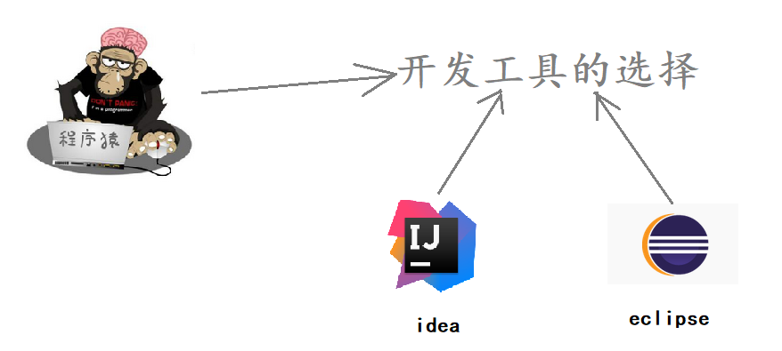
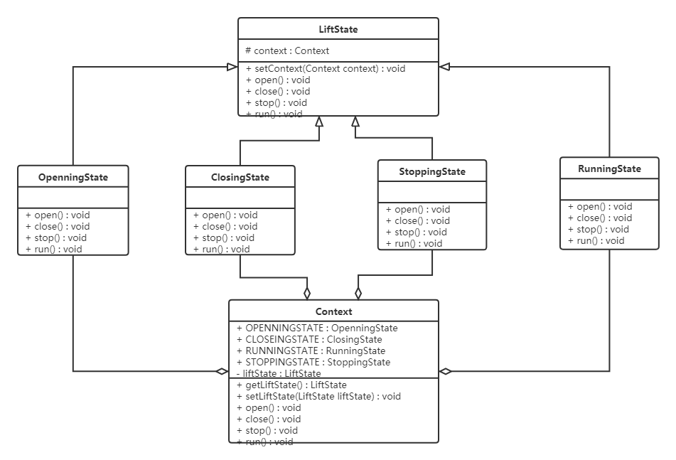
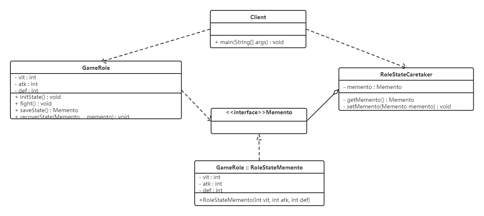

# 软件设计模式-详细讲解（代码示例）

## 1、项目介绍
&emsp;&emsp;软件设计模式（Software Design Pattern），又称设计模式，是一套被反复使用、多数人知晓
的、经过分类编目的、代码设计经验的总结。

&emsp;&emsp;本项目是通过代码示例的方式，讲解行为型模式：
* 模板方法模式
* 策略模式
* 命令模式
* 职责链模式
* 状态模式
* 观察者模式
* 中介者模式
* 迭代器模式
* 访问者模式
* 备忘录模式
* 解释器模式

&emsp;&emsp;行为型模式用于描述程序在运行时复杂的流程控制，即描述多个类或对象之间怎样相互协作共同完成单个对象都无法单独完成的任务，它涉及算法与对象间职责的分配。

&emsp;&emsp;行为型模式分为类行为模式和对象行为模式，前者采用继承机制来在类间分派行为，后者采用组合或聚合在对象间分配行为。由于组合关系或聚合关系比继承关系耦合度低，满足“合成复用原则”，所以对象行为模式比类行为模式具有更大的灵活性。

&emsp;&emsp;本项目属于《设计模式系列》：  
* [《通过代码示例，讲解单例模式：2种饿汉模式的实现、4种懒汉模式实现、序列化和反射是如何破坏单例的、如何防止序列化和反射破坏单例》](https://github.com/xiaoguangbiao-github/design_patterns_singleton.git)  
* [《通过代码示例，讲解创建型模式：工厂方法模式、抽象工厂模式、原型模式、建造者模式》](https://github.com/xiaoguangbiao-github/design_patterns_create.git)  
* [《通过代码示例，讲解结构型模式：代理模式、适配器模式、装饰者模式、桥接模式、外观模式、组合模式、享元模式》](https://github.com/xiaoguangbiao-github/design_patterns_structure.git)  
* [《通过代码示例，讲解行为型模式：模板方法模式、策略模式、命令模式、职责链模式、状态模式、观察者模式、中介者模式、迭代器模式、访问者模式、备忘录模式、解释器模式》](https://github.com/xiaoguangbiao-github/design_patterns_action.git)  


## 2、开发环境

- 语言：Java 8

- Eclipse/IDEA

- 依赖管理：Maven


## 3、项目目录
pattern  
├─command   &emsp;//命令模式  
│&emsp;&emsp;Client.java  
│&emsp;&emsp;Command.java  
│&emsp;&emsp;Order.java  
│&emsp;&emsp;OrderCommand.java  
│&emsp;&emsp;SeniorChef.java  
│&emsp;&emsp;Waitor.java  
│  
├─interpreter   &emsp;//解释器模式  
│&emsp;&emsp;AbstractExpression.java  
│&emsp;&emsp;Client.java  
│&emsp;&emsp;Context.java  
│&emsp;&emsp;Minus.java  
│&emsp;&emsp;Plus.java  
│&emsp;&emsp;Variable.java  
│  
├─iterator   &emsp;//迭代器模式   
│&emsp;&emsp;Client.java  
│&emsp;&emsp;Student.java  
│&emsp;&emsp;StudentAggregate.java  
│&emsp;&emsp;StudentAggregateImpl.java  
│&emsp;&emsp;StudentIterator.java  
│&emsp;&emsp;StudentIteratorImpl.java  
│  
├─mediator   &emsp;//中介者模式   
│&emsp;&emsp;Client.java  
│&emsp;&emsp;HouseOwner.java  
│&emsp;&emsp;Mediator.java  
│&emsp;&emsp;MediatorStructure.java  
│&emsp;&emsp;Person.java  
│&emsp;&emsp;Tenant.java  
│  
├─memento   &emsp;//备忘录模式   
│  ├─black_box  
│  │&emsp;&emsp;Client.java  
│  │&emsp;&emsp;GameRole.java  
│  │&emsp;&emsp;Memento.java  
│  │&emsp;&emsp;RoleStateCaretaker.java  
│  │  
│  └─white_box  
│&emsp;&emsp;    Client.java  
│&emsp;&emsp;    GameRole.java  
│&emsp;&emsp;    RoleStateCaretaker.java  
│&emsp;&emsp;    RoleStateMemento.java  
│     
├─observer   &emsp;//观察者模式  
│&emsp;&emsp;Client.java  
│&emsp;&emsp;Observer.java  
│&emsp;&emsp;Subject.java  
│&emsp;&emsp;SubscriptionSubject.java  
│&emsp;&emsp;WeiXinUser.java  
│  
├─responsibility   &emsp;//职责链模式  
│  │  Client.java  
│  │  GeneralManager.java  
│  │  GroupLeader.java  
│  │  Handler.java  
│  │  LeaveRequest.java  
│  │  Manager.java  
│  │  
│  └─jdk  
│&emsp;&emsp;    Client.java  
│&emsp;&emsp;    Filter.java  
│&emsp;&emsp;    FilterChain.java  
│&emsp;&emsp;    FirstFilter.java  
│&emsp;&emsp;    Request.java  
│&emsp;&emsp;    Response.java  
│&emsp;&emsp;    SecondFilter.java  
│     
├─state   &emsp;//状态模式    
│  ├─after  
│  │&emsp;&emsp;Client.java  
│  │&emsp;&emsp;ClosingState.java  
│  │&emsp;&emsp;Context.java  
│  │&emsp;&emsp;LiftState.java  
│  │&emsp;&emsp;OpeningState.java  
│  │&emsp;&emsp;RunningState.java  
│  │&emsp;&emsp;StoppingState.java  
│  │  
│  └─before  
│&emsp;&emsp;    Client.java  
│&emsp;&emsp;    ILift.java  
│&emsp;&emsp;    Lift.java  
│   
├─strategy   &emsp;//策略模式  
│&emsp;&emsp;Client.java  
│&emsp;&emsp;SalesMan.java  
│&emsp;&emsp;Strategy.java  
│&emsp;&emsp;StrategyA.java  
│&emsp;&emsp;StrategyB.java  
│&emsp;&emsp;StrategyC.java  
│  
├─template   &emsp;//模板方法模式  
│&emsp;&emsp;AbstractClass.java  
│&emsp;&emsp;Client.java  
│&emsp;&emsp;ConcreteClass_BaoCai.java  
│&emsp;&emsp;ConcreteClass_CaiXin.java  
│  
└─visitor   &emsp;//访问者模式  
&emsp;&emsp;Animal.java  
&emsp;&emsp;Cat.java  
&emsp;&emsp;Client.java  
&emsp;&emsp;Dog.java  
&emsp;&emsp;Home.java  
&emsp;&emsp;Owner.java  
&emsp;&emsp;Person.java  
&emsp;&emsp;Someone.java  
&emsp;&emsp;
&emsp;└─dispatch  
      
       
                    
└─principles   &emsp;//设计原则  
&emsp;&emsp;├─demo1  &emsp;//开闭原则   
&emsp;&emsp;│&emsp;&emsp;  Client.java   
&emsp;&emsp;│&emsp;&emsp;  DefaultSkin.java   
&emsp;&emsp;│&emsp;&emsp;  HeimaSkin.java   
&emsp;&emsp;│&emsp;&emsp;  ougouInput.java   
&emsp;&emsp;│      
&emsp;&emsp;├─demo2  &emsp;//里氏代换原则   
&emsp;&emsp;│&emsp;├─after  &emsp;//使用里氏代换原则示例  
&emsp;&emsp;│&emsp;│&emsp;  Quadrilateral.java  
&emsp;&emsp;│&emsp;│&emsp;   Rectangle.java  
&emsp;&emsp;│&emsp;│&emsp;   RectangleDemo.java  
&emsp;&emsp;│&emsp;│&emsp;   Square.java  
&emsp;&emsp;│&emsp;│      
&emsp;&emsp;│&emsp;└─before  &emsp;//不使用示例  
&emsp;&emsp;│&emsp;│&emsp;  Rectangle.java   
&emsp;&emsp;│&emsp;│&emsp;  RectangleDemo.java   
&emsp;&emsp;│&emsp;│&emsp;   Square.java   
&emsp;&emsp;│          
&emsp;&emsp;├─demo3  &emsp;//依赖倒转原则  
&emsp;&emsp;│&emsp;├─after   &emsp;//使用依赖倒转原则示例  
&emsp;&emsp;│&emsp;│&emsp;  Computer.java  
&emsp;&emsp;│&emsp;│&emsp; ComputerDemo.java  
&emsp;&emsp;│&emsp;│&emsp;  Cpu.java  
&emsp;&emsp;│&emsp;│&emsp;  HardDisk.java  
&emsp;&emsp;│&emsp;│&emsp; IntelCpu.java  
&emsp;&emsp;│&emsp;│&emsp;  KingstonMemory.java  
&emsp;&emsp;│&emsp;│&emsp;  Memory.java  
&emsp;&emsp;│&emsp;│&emsp;  XiJieHardDisk.java   
&emsp;&emsp;│&emsp;│    
&emsp;&emsp;│&emsp;└─before   &emsp;//不使用示例  
&emsp;&emsp;│&emsp;│&emsp;   Computer.java   
&emsp;&emsp;│&emsp;│&emsp;  ComputerDemo.java   
&emsp;&emsp;│&emsp;│&emsp;   IntelCpu.java   
&emsp;&emsp;│&emsp;│&emsp;   KingstonMemory.java   
&emsp;&emsp;│&emsp;│&emsp;   XiJieHardDisk.java   
&emsp;&emsp;│          
&emsp;&emsp;├─demo4  &emsp;//接口隔离原则  
&emsp;&emsp;│&emsp;├─after    &emsp;//使用接口隔离原则示例  
&emsp;&emsp;│&emsp;│&emsp;   AntiTheft.java   
&emsp;&emsp;│&emsp;│&emsp;    Client.java   
&emsp;&emsp;│&emsp;│&emsp;   Fireproof.java   
&emsp;&emsp;│&emsp;│&emsp;   HeiMaSafetyDoor.java   
&emsp;&emsp;│&emsp;│&emsp;    ItcastSafetyDoor.java   
&emsp;&emsp;│&emsp;│&emsp;   Waterproof.java   
&emsp;&emsp;│&emsp;│      
&emsp;&emsp;│&emsp;└─before    &emsp;//不使用示例   
&emsp;&emsp;│&emsp;&emsp;&emsp;      Client.java   
&emsp;&emsp;│&emsp;&emsp;&emsp;     HeimaSafetyDoor.java   
&emsp;&emsp;│&emsp;&emsp;&emsp;   SafetyDoor.java   
&emsp;&emsp;│           
&emsp;&emsp;└─demo5  &emsp;//迪米特法则  
&emsp;&emsp;&emsp;&emsp;   Agent.java   
&emsp;&emsp;&emsp;&emsp;   Client.java   
&emsp;&emsp;&emsp;&emsp;  Company.java   
&emsp;&emsp;&emsp;&emsp;  Fans.java   
&emsp;&emsp;&emsp;&emsp;  Star.java   


## 4 模板方法模式

### 4.1 概述

在面向对象程序设计过程中，程序员常常会遇到这种情况：设计一个系统时知道了算法所需的关键步骤，而且确定了这些步骤的执行顺序，但某些步骤的具体实现还未知，或者说某些步骤的实现与具体的环境相关。

例如，去银行办理业务一般要经过以下4个流程：取号、排队、办理具体业务、对银行工作人员进行评分等，其中取号、排队和对银行工作人员进行评分的业务对每个客户是一样的，可以在父类中实现，但是办理具体业务却因人而异，它可能是存款、取款或者转账等，可以延迟到子类中实现。

**定义：**

定义一个操作中的算法骨架，而将算法的一些步骤延迟到子类中，使得子类可以不改变该算法结构的情况下重定义该算法的某些特定步骤。


###  4.2 结构

模板方法（Template Method）模式包含以下主要角色：

* 抽象类（Abstract Class）：负责给出一个算法的轮廓和骨架。它由一个模板方法和若干个基本方法构成。

  * 模板方法：定义了算法的骨架，按某种顺序调用其包含的基本方法。

  * 基本方法：是实现算法各个步骤的方法，是模板方法的组成部分。基本方法又可以分为三种：

    * 抽象方法(Abstract Method) ：一个抽象方法由抽象类声明、由其具体子类实现。

    * 具体方法(Concrete Method) ：一个具体方法由一个抽象类或具体类声明并实现，其子类可以进行覆盖也可以直接继承。

    * 钩子方法(Hook Method) ：在抽象类中已经实现，包括用于判断的逻辑方法和需要子类重写的空方法两种。

      一般钩子方法是用于判断的逻辑方法，这类方法名一般为isXxx，返回值类型为boolean类型。

* 具体子类（Concrete Class）：实现抽象类中所定义的抽象方法和钩子方法，它们是一个顶级逻辑的组成步骤。


### 4.3 案例实现

【例】炒菜

炒菜的步骤是固定的，分为倒油、热油、倒蔬菜、倒调料品、翻炒等步骤。现通过模板方法模式来用代码模拟。类图如下：


代码如下：

```java
public abstract class AbstractClass {
    
    public final void cookProcess() {
        //第一步：倒油
        this.pourOil();
        //第二步：热油
        this.heatOil();
        //第三步：倒蔬菜
        this.pourVegetable();
        //第四步：倒调味料
        this.pourSauce();
        //第五步：翻炒
        this.fry();
    }

    public void pourOil() {
        System.out.println("倒油");
    }

    //第二步：热油是一样的，所以直接实现
    public void heatOil() {
        System.out.println("热油");
    }

    //第三步：倒蔬菜是不一样的（一个下包菜，一个是下菜心）
    public abstract void pourVegetable();

    //第四步：倒调味料是不一样
    public abstract void pourSauce();


    //第五步：翻炒是一样的，所以直接实现
    public void fry(){
        System.out.println("炒啊炒啊炒到熟啊");
    }
}

public class ConcreteClass_BaoCai extends AbstractClass {

    @Override
    public void pourVegetable() {
        System.out.println("下锅的蔬菜是包菜");
    }

    @Override
    public void pourSauce() {
        System.out.println("下锅的酱料是辣椒");
    }
}

public class ConcreteClass_CaiXin extends AbstractClass {
    @Override
    public void pourVegetable() {
        System.out.println("下锅的蔬菜是菜心");
    }

    @Override
    public void pourSauce() {
        System.out.println("下锅的酱料是蒜蓉");
    }
}

public class Client {
    public static void main(String[] args) {
        //炒手撕包菜
        ConcreteClass_BaoCai baoCai = new ConcreteClass_BaoCai();
        baoCai.cookProcess();

        //炒蒜蓉菜心
        ConcreteClass_CaiXin caiXin = new ConcreteClass_CaiXin();
        caiXin.cookProcess();
    }
}
```

> 注意：为防止恶意操作，一般模板方法都加上 final 关键词。


### 4.3 优缺点

**优点：**

* 提高代码复用性

  将相同部分的代码放在抽象的父类中，而将不同的代码放入不同的子类中。

* 实现了反向控制

  通过一个父类调用其子类的操作，通过对子类的具体实现扩展不同的行为，实现了反向控制 ，并符合“开闭原则”。

**缺点：**

* 对每个不同的实现都需要定义一个子类，这会导致类的个数增加，系统更加庞大，设计也更加抽象。
* 父类中的抽象方法由子类实现，子类执行的结果会影响父类的结果，这导致一种反向的控制结构，它提高了代码阅读的难度。


### 4.4 适用场景

* 算法的整体步骤很固定，但其中个别部分易变时，这时候可以使用模板方法模式，将容易变的部分抽象出来，供子类实现。
* 需要通过子类来决定父类算法中某个步骤是否执行，实现子类对父类的反向控制。


### 4.5 JDK源码解析

InputStream类就使用了模板方法模式。在InputStream类中定义了多个 `read()` 方法，如下：

```java
public abstract class InputStream implements Closeable {
    //抽象方法，要求子类必须重写
    public abstract int read() throws IOException;

    public int read(byte b[]) throws IOException {
        return read(b, 0, b.length);
    }

    public int read(byte b[], int off, int len) throws IOException {
        if (b == null) {
            throw new NullPointerException();
        } else if (off < 0 || len < 0 || len > b.length - off) {
            throw new IndexOutOfBoundsException();
        } else if (len == 0) {
            return 0;
        }

        int c = read(); //调用了无参的read方法，该方法是每次读取一个字节数据
        if (c == -1) {
            return -1;
        }
        b[off] = (byte)c;

        int i = 1;
        try {
            for (; i < len ; i++) {
                c = read();
                if (c == -1) {
                    break;
                }
                b[off + i] = (byte)c;
            }
        } catch (IOException ee) {
        }
        return i;
    }
}
```

从上面代码可以看到，无参的 `read()` 方法是抽象方法，要求子类必须实现。而 `read(byte b[])` 方法调用了 `read(byte b[], int off, int len)` 方法，所以在此处重点看的方法是带三个参数的方法。 

在该方法中第18行、27行，可以看到调用了无参的抽象的 `read()` 方法。

总结如下： 在InputStream父类中已经定义好了读取一个字节数组数据的方法是每次读取一个字节，并将其存储到数组的第一个索引位置，读取len个字节数据。具体如何读取一个字节数据呢？由子类实现。


## 5 策略模式

### 5.1 概述

先看下面的图片，我们去旅游选择出行模式有很多种，可以骑自行车、可以坐汽车、可以坐火车、可以坐飞机。


作为一个程序猿，开发需要选择一款开发工具，当然可以进行代码开发的工具有很多，可以选择Idea进行开发，也可以使用eclipse进行开发，也可以使用其他的一些开发工具。



**定义：**

​	该模式定义了一系列算法，并将每个算法封装起来，使它们可以相互替换，且算法的变化不会影响使用算法的客户。策略模式属于对象行为模式，它通过对算法进行封装，把使用算法的责任和算法的实现分割开来，并委派给不同的对象对这些算法进行管理。


### 5.2 结构

策略模式的主要角色如下：

* 抽象策略（Strategy）类：这是一个抽象角色，通常由一个接口或抽象类实现。此角色给出所有的具体策略类所需的接口。
* 具体策略（Concrete Strategy）类：实现了抽象策略定义的接口，提供具体的算法实现或行为。
* 环境（Context）类：持有一个策略类的引用，最终给客户端调用。


### 5.3 案例实现

【例】促销活动

一家百货公司在定年度的促销活动。针对不同的节日（春节、中秋节、圣诞节）推出不同的促销活动，由促销员将促销活动展示给客户。类图如下：


代码如下：

定义百货公司所有促销活动的共同接口

```java
public interface Strategy {
    void show();
}
```

定义具体策略角色（Concrete Strategy）：每个节日具体的促销活动

```java
//为春节准备的促销活动A
public class StrategyA implements Strategy {

    public void show() {
        System.out.println("买一送一");
    }
}

//为中秋准备的促销活动B
public class StrategyB implements Strategy {

    public void show() {
        System.out.println("满200元减50元");
    }
}

//为圣诞准备的促销活动C
public class StrategyC implements Strategy {

    public void show() {
        System.out.println("满1000元加一元换购任意200元以下商品");
    }
}
```

定义环境角色（Context）：用于连接上下文，即把促销活动推销给客户，这里可以理解为销售员

```java
public class SalesMan {                        
    //持有抽象策略角色的引用                              
    private Strategy strategy;                 
                                               
    public SalesMan(Strategy strategy) {       
        this.strategy = strategy;              
    }                                          
                                               
    //向客户展示促销活动                                
    public void salesManShow(){                
        strategy.show();                       
    }                                          
}                                              
```


### 5.4 优缺点

**1，优点：**

* 策略类之间可以自由切换

  由于策略类都实现同一个接口，所以使它们之间可以自由切换。

* 易于扩展

  增加一个新的策略只需要添加一个具体的策略类即可，基本不需要改变原有的代码，符合“开闭原则“

* 避免使用多重条件选择语句（if else），充分体现面向对象设计思想。

**2，缺点：**

* 客户端必须知道所有的策略类，并自行决定使用哪一个策略类。
* 策略模式将造成产生很多策略类，可以通过使用享元模式在一定程度上减少对象的数量。


### 5.5 使用场景

* 一个系统需要动态地在几种算法中选择一种时，可将每个算法封装到策略类中。
* 一个类定义了多种行为，并且这些行为在这个类的操作中以多个条件语句的形式出现，可将每个条件分支移入它们各自的策略类中以代替这些条件语句。
* 系统中各算法彼此完全独立，且要求对客户隐藏具体算法的实现细节时。
* 系统要求使用算法的客户不应该知道其操作的数据时，可使用策略模式来隐藏与算法相关的数据结构。
* 多个类只区别在表现行为不同，可以使用策略模式，在运行时动态选择具体要执行的行为。


### 5.6 JDK源码解析

`Comparator` 中的策略模式。在Arrays类中有一个 `sort()` 方法，如下：

```java
public class Arrays{
    public static <T> void sort(T[] a, Comparator<? super T> c) {
        if (c == null) {
            sort(a);
        } else {
            if (LegacyMergeSort.userRequested)
                legacyMergeSort(a, c);
            else
                TimSort.sort(a, 0, a.length, c, null, 0, 0);
        }
    }
}
```

Arrays就是一个环境角色类，这个sort方法可以传一个新策略让Arrays根据这个策略来进行排序。就比如下面的测试类。

```java
public class demo {
    public static void main(String[] args) {

        Integer[] data = {12, 2, 3, 2, 4, 5, 1};
        // 实现降序排序
        Arrays.sort(data, new Comparator<Integer>() {
            public int compare(Integer o1, Integer o2) {
                return o2 - o1;
            }
        });
        System.out.println(Arrays.toString(data)); //[12, 5, 4, 3, 2, 2, 1]
    }
}
```

这里我们在调用Arrays的sort方法时，第二个参数传递的是Comparator接口的子实现类对象。所以Comparator充当的是抽象策略角色，而具体的子实现类充当的是具体策略角色。环境角色类（Arrays）应该持有抽象策略的引用来调用。那么，Arrays类的sort方法到底有没有使用Comparator子实现类中的 `compare()` 方法吗？让我们继续查看TimSort类的 `sort()` 方法，代码如下：

```java
class TimSort<T> {
    static <T> void sort(T[] a, int lo, int hi, Comparator<? super T> c,
                         T[] work, int workBase, int workLen) {
        assert c != null && a != null && lo >= 0 && lo <= hi && hi <= a.length;

        int nRemaining  = hi - lo;
        if (nRemaining < 2)
            return;  // Arrays of size 0 and 1 are always sorted

        // If array is small, do a "mini-TimSort" with no merges
        if (nRemaining < MIN_MERGE) {
            int initRunLen = countRunAndMakeAscending(a, lo, hi, c);
            binarySort(a, lo, hi, lo + initRunLen, c);
            return;
        }
        ...
    }   
        
    private static <T> int countRunAndMakeAscending(T[] a, int lo, int hi,Comparator<? super T> c) {
        assert lo < hi;
        int runHi = lo + 1;
        if (runHi == hi)
            return 1;

        // Find end of run, and reverse range if descending
        if (c.compare(a[runHi++], a[lo]) < 0) { // Descending
            while (runHi < hi && c.compare(a[runHi], a[runHi - 1]) < 0)
                runHi++;
            reverseRange(a, lo, runHi);
        } else {                              // Ascending
            while (runHi < hi && c.compare(a[runHi], a[runHi - 1]) >= 0)
                runHi++;
        }

        return runHi - lo;
    }
}
```

上面的代码中最终会跑到 `countRunAndMakeAscending()` 这个方法中。我们可以看见，只用了compare方法，所以在调用Arrays.sort方法只传具体compare重写方法的类对象就行，这也是Comparator接口中必须要子类实现的一个方法。


## 6 命令模式

### 6.1 概述

日常生活中，我们出去吃饭都会遇到下面的场景。


**定义：**

将一个请求封装为一个对象，使发出请求的责任和执行请求的责任分割开。这样两者之间通过命令对象进行沟通，这样方便将命令对象进行存储、传递、调用、增加与管理。


### 6.2 结构

命令模式包含以下主要角色：

* 抽象命令类（Command）角色： 定义命令的接口，声明执行的方法。
* 具体命令（Concrete  Command）角色：具体的命令，实现命令接口；通常会持有接收者，并调用接收者的功能来完成命令要执行的操作。
* 实现者/接收者（Receiver）角色： 接收者，真正执行命令的对象。任何类都可能成为一个接收者，只要它能够实现命令要求实现的相应功能。
* 调用者/请求者（Invoker）角色： 要求命令对象执行请求，通常会持有命令对象，可以持有很多的命令对象。这个是客户端真正触发命令并要求命令执行相应操作的地方，也就是说相当于使用命令对象的入口。


### 6.3 案例实现

将上面的案例用代码实现，那我们就需要分析命令模式的角色在该案例中由谁来充当。

服务员： 就是调用者角色，由她来发起命令。

资深大厨： 就是接收者角色，真正命令执行的对象。

订单： 命令中包含订单。

类图如下：


代码如下：

```java
public interface Command {
    void execute();//只需要定义一个统一的执行方法
}

public class OrderCommand implements Command {

    //持有接受者对象
    private SeniorChef receiver;
    private Order order;

    public OrderCommand(SeniorChef receiver, Order order){
        this.receiver = receiver;
        this.order = order;
    }

    public void execute()  {
        System.out.println(order.getDiningTable() + "桌的订单：");
        Set<String> keys = order.getFoodDic().keySet();
        for (String key : keys) {
            receiver.makeFood(order.getFoodDic().get(key),key);
        }

        try {
            Thread.sleep(100);//停顿一下 模拟做饭的过程
        } catch (InterruptedException e) {
            e.printStackTrace();
        }


        System.out.println(order.getDiningTable() + "桌的饭弄好了");
    }
}

public class Order {
    // 餐桌号码
    private int diningTable;

    // 用来存储餐名并记录份数
    private Map<String, Integer> foodDic = new HashMap<String, Integer>();

    public int getDiningTable() {
        return diningTable;
    }

    public void setDiningTable(int diningTable) {
        this.diningTable = diningTable;
    }

    public Map<String, Integer> getFoodDic() {
        return foodDic;
    }

    public void setFoodDic(String name, int num) {
        foodDic.put(name,num);
    }
}

// 资深大厨类 是命令的Receiver
public class SeniorChef {

    public void makeFood(int num,String foodName) {
        System.out.println(num + "份" + foodName);
    }
}

public class Waitor {

    private ArrayList<Command> commands;//可以持有很多的命令对象

    public Waitor() {
        commands = new ArrayList();
    }
    
    public void setCommand(Command cmd){
        commands.add(cmd);
    }

    // 发出命令 喊 订单来了，厨师开始执行
    public void orderUp() {
        System.out.println("美女服务员：叮咚，大厨，新订单来了.......");
        for (int i = 0; i < commands.size(); i++) {
            Command cmd = commands.get(i);
            if (cmd != null) {
                cmd.execute();
            }
        }
    }
}

public class Client {
    public static void main(String[] args) {
        //创建2个order
        Order order1 = new Order();
        order1.setDiningTable(1);
        order1.getFoodDic().put("西红柿鸡蛋面",1);
        order1.getFoodDic().put("小杯可乐",2);

        Order order2 = new Order();
        order2.setDiningTable(3);
        order2.getFoodDic().put("尖椒肉丝盖饭",1);
        order2.getFoodDic().put("小杯雪碧",1);

        //创建接收者
        SeniorChef receiver=new SeniorChef();
        //将订单和接收者封装成命令对象
        OrderCommand cmd1 = new OrderCommand(receiver, order1);
        OrderCommand cmd2 = new OrderCommand(receiver, order2);
        //创建调用者 waitor
        Waitor invoker = new Waitor();
        invoker.setCommand(cmd1);
        invoker.setCommand(cmd2);

        //将订单带到柜台 并向厨师喊 订单来了
        invoker.orderUp();
    }
}
```


### 6.4 优缺点

**1，优点：**

* 降低系统的耦合度。命令模式能将调用操作的对象与实现该操作的对象解耦。
* 增加或删除命令非常方便。采用命令模式增加与删除命令不会影响其他类，它满足“开闭原则”，对扩展比较灵活。
* 可以实现宏命令。命令模式可以与组合模式结合，将多个命令装配成一个组合命令，即宏命令。
* 方便实现 Undo 和 Redo 操作。命令模式可以与后面介绍的备忘录模式结合，实现命令的撤销与恢复。

**2，缺点：**

* 使用命令模式可能会导致某些系统有过多的具体命令类。
* 系统结构更加复杂。


### 6.5 使用场景

* 系统需要将请求调用者和请求接收者解耦，使得调用者和接收者不直接交互。
* 系统需要在不同的时间指定请求、将请求排队和执行请求。
* 系统需要支持命令的撤销(Undo)操作和恢复(Redo)操作。


### 6.6 JDK源码解析

Runable是一个典型命令模式，Runnable担当命令的角色，Thread充当的是调用者，start方法就是其执行方法

```java
//命令接口(抽象命令角色)
public interface Runnable {
	public abstract void run();
}

//调用者
public class Thread implements Runnable {
    private Runnable target;
    
    public synchronized void start() {
        if (threadStatus != 0)
            throw new IllegalThreadStateException();

        group.add(this);

        boolean started = false;
        try {
            start0();
            started = true;
        } finally {
            try {
                if (!started) {
                    group.threadStartFailed(this);
                }
            } catch (Throwable ignore) {
            }
        }
    }
    
    private native void start0();
}
```

会调用一个native方法start0(),调用系统方法，开启一个线程。而接收者是对程序员开放的，可以自己定义接收者。

```java
/**
 * jdk Runnable 命令模式
 *		TurnOffThread ： 属于具体
 */
public class TurnOffThread implements Runnable{
     private Receiver receiver;
    
     public TurnOffThread(Receiver receiver) {
     	this.receiver = receiver;
     }
     public void run() {
     	receiver.turnOFF();
     }
}
```

```java
/**
 * 测试类
 */
public class Demo {
     public static void main(String[] args) {
         Receiver receiver = new Receiver();
         TurnOffThread turnOffThread = new TurnOffThread(receiver);
         Thread thread = new Thread(turnOffThread);
         thread.start();
     }
}
```


## 7 责任链模式

### 7.1 概述

在现实生活中，常常会出现这样的事例：一个请求有多个对象可以处理，但每个对象的处理条件或权限不同。例如，公司员工请假，可批假的领导有部门负责人、副总经理、总经理等，但每个领导能批准的天数不同，员工必须根据自己要请假的天数去找不同的领导签名，也就是说员工必须记住每个领导的姓名、电话和地址等信息，这增加了难度。这样的例子还有很多，如找领导出差报销、生活中的“击鼓传花”游戏等。

**定义：**

又名职责链模式，为了避免请求发送者与多个请求处理者耦合在一起，将所有请求的处理者通过前一对象记住其下一个对象的引用而连成一条链；当有请求发生时，可将请求沿着这条链传递，直到有对象处理它为止。


### 7.2 结构

职责链模式主要包含以下角色:

* 抽象处理者（Handler）角色：定义一个处理请求的接口，包含抽象处理方法和一个后继连接。
* 具体处理者（Concrete Handler）角色：实现抽象处理者的处理方法，判断能否处理本次请求，如果可以处理请求则处理，否则将该请求转给它的后继者。
* 客户类（Client）角色：创建处理链，并向链头的具体处理者对象提交请求，它不关心处理细节和请求的传递过程。


### 7.3 案例实现

现需要开发一个请假流程控制系统。请假一天以下的假只需要小组长同意即可；请假1天到3天的假还需要部门经理同意；请求3天到7天还需要总经理同意才行。

类图如下：


代码如下：

```java
//请假条
public class LeaveRequest {
    private String name;//姓名
    private int num;//请假天数
    private String content;//请假内容

    public LeaveRequest(String name, int num, String content) {
        this.name = name;
        this.num = num;
        this.content = content;
    }

    public String getName() {
        return name;
    }

    public int getNum() {
        return num;
    }

    public String getContent() {
        return content;
    }
}

//处理者抽象类
public abstract class Handler {
    protected final static int NUM_ONE = 1;
    protected final static int NUM_THREE = 3;
    protected final static int NUM_SEVEN = 7;

    //该领导处理的请假天数区间
    private int numStart;
    private int numEnd;

    //领导上面还有领导
    private Handler nextHandler;

    //设置请假天数范围 上不封顶
    public Handler(int numStart) {
        this.numStart = numStart;
    }

    //设置请假天数范围
    public Handler(int numStart, int numEnd) {
        this.numStart = numStart;
        this.numEnd = numEnd;
    }

    //设置上级领导
    public void setNextHandler(Handler nextHandler){
        this.nextHandler = nextHandler;
    }

    //提交请假条
    public final void submit(LeaveRequest leave){
        if(0 == this.numStart){
            return;
        }

        //如果请假天数达到该领导者的处理要求
        if(leave.getNum() >= this.numStart){
            this.handleLeave(leave);

            //如果还有上级 并且请假天数超过了当前领导的处理范围
            if(null != this.nextHandler && leave.getNum() > numEnd){
                this.nextHandler.submit(leave);//继续提交
            } else {
                System.out.println("流程结束");
            }
        }
    }

    //各级领导处理请假条方法
    protected abstract void handleLeave(LeaveRequest leave);
}

//小组长
public class GroupLeader extends Handler {
    public GroupLeader() {
        //小组长处理1-3天的请假
        super(Handler.NUM_ONE, Handler.NUM_THREE);
    }

    @Override
    protected void handleLeave(LeaveRequest leave) {
        System.out.println(leave.getName() + "请假" + leave.getNum() + "天," + leave.getContent() + "。");
        System.out.println("小组长审批：同意。");
    }
}

//部门经理
public class Manager extends Handler {
    public Manager() {
        //部门经理处理3-7天的请假
        super(Handler.NUM_THREE, Handler.NUM_SEVEN);
    }

    @Override
    protected void handleLeave(LeaveRequest leave) {
        System.out.println(leave.getName() + "请假" + leave.getNum() + "天," + leave.getContent() + "。");
        System.out.println("部门经理审批：同意。");
    }
}

//总经理
public class GeneralManager extends Handler {
    public GeneralManager() {
        //部门经理处理7天以上的请假
        super(Handler.NUM_SEVEN);
    }

    @Override
    protected void handleLeave(LeaveRequest leave) {
        System.out.println(leave.getName() + "请假" + leave.getNum() + "天," + leave.getContent() + "。");
        System.out.println("总经理审批：同意。");
    }
}

//测试类
public class Client {
    public static void main(String[] args) {
        //请假条来一张
        LeaveRequest leave = new LeaveRequest("小花",5,"身体不适");

        //各位领导
        GroupLeader groupLeader = new GroupLeader();
        Manager manager = new Manager();
        GeneralManager generalManager = new GeneralManager();

        groupLeader.setNextHandler(manager);//小组长的领导是部门经理
        manager.setNextHandler(generalManager);//部门经理的领导是总经理
        //之所以在这里设置上级领导，是因为可以根据实际需求来更改设置，如果实战中上级领导人都是固定的，则可以移到领导实现类中。

        //提交申请
        groupLeader.submit(leave);
    }
}
```


### 7.4 优缺点

**1，优点：**

* 降低了对象之间的耦合度

  该模式降低了请求发送者和接收者的耦合度。

* 增强了系统的可扩展性

  可以根据需要增加新的请求处理类，满足开闭原则。

* 增强了给对象指派职责的灵活性

  当工作流程发生变化，可以动态地改变链内的成员或者修改它们的次序，也可动态地新增或者删除责任。

* 责任链简化了对象之间的连接

  一个对象只需保持一个指向其后继者的引用，不需保持其他所有处理者的引用，这避免了使用众多的 if 或者 if···else 语句。

* 责任分担

  每个类只需要处理自己该处理的工作，不能处理的传递给下一个对象完成，明确各类的责任范围，符合类的单一职责原则。

**2，缺点：**

* 不能保证每个请求一定被处理。由于一个请求没有明确的接收者，所以不能保证它一定会被处理，该请求可能一直传到链的末端都得不到处理。
* 对比较长的职责链，请求的处理可能涉及多个处理对象，系统性能将受到一定影响。
* 职责链建立的合理性要靠客户端来保证，增加了客户端的复杂性，可能会由于职责链的错误设置而导致系统出错，如可能会造成循环调用。


### 7.5 源码解析

在javaWeb应用开发中，FilterChain是职责链（过滤器）模式的典型应用，以下是Filter的模拟实现分析:

* 模拟web请求Request以及web响应Response

  ```java
  public interface Request{
   
  }
  
  public interface Response{
   
  }
  ```

* 模拟web过滤器Filter

  ```java
   public interface Filter {
   	public void doFilter(Request req,Response res,FilterChain c);
   }
  ```

* 模拟实现具体过滤器  

  ```java
  public class FirstFilter implements Filter {
      @Override
      public void doFilter(Request request, Response response, FilterChain chain) {
  
          System.out.println("过滤器1 前置处理");
  
          // 先执行所有request再倒序执行所有response
          chain.doFilter(request, response);
  
          System.out.println("过滤器1 后置处理");
      }
  }
  
  public class SecondFilter  implements Filter {
      @Override
      public void doFilter(Request request, Response response, FilterChain chain) {
  
          System.out.println("过滤器2 前置处理");
  
          // 先执行所有request再倒序执行所有response
          chain.doFilter(request, response);
  
          System.out.println("过滤器2 后置处理");
      }
  }
  ```

* 模拟实现过滤器链FilterChain  

  ```java
  public class FilterChain {
  
      private List<Filter> filters = new ArrayList<Filter>();
  
      private int index = 0;
  
      // 链式调用
      public FilterChain addFilter(Filter filter) {
          this.filters.add(filter);
          return this;
      }
  
      public void doFilter(Request request, Response response) {
          if (index == filters.size()) {
              return;
          }
          Filter filter = filters.get(index);
          index++;
          filter.doFilter(request, response, this);
      }
  }
  ```

* 测试类

  ```java
  public class Client {
      public static void main(String[] args) {
          Request  req = null;
          Response res = null ;
  
          FilterChain filterChain = new FilterChain();
          filterChain.addFilter(new FirstFilter()).addFilter(new SecondFilter());
          filterChain.doFilter(req,res);
      }
  }
  ```

## 8 状态模式

### 8.1 概述

【例】通过按钮来控制一个电梯的状态，一个电梯有开门状态，关门状态，停止状态，运行状态。每一种状态改变，都有可能要根据其他状态来更新处理。例如，如果电梯门现在处于运行时状态，就不能进行开门操作，而如果电梯门是停止状态，就可以执行开门操作。

类图如下：


代码如下：

```java
public interface ILift {
    //电梯的4个状态
    //开门状态
    public final static int OPENING_STATE = 1;
    //关门状态
    public final static int CLOSING_STATE = 2;
    //运行状态
    public final static int RUNNING_STATE = 3;
    //停止状态
    public final static int STOPPING_STATE = 4;

    //设置电梯的状态
    public void setState(int state);

    //电梯的动作
    public void open();
    public void close();
    public void run();
    public void stop();
}

public class Lift implements ILift {
    private int state;

    @Override
    public void setState(int state) {
        this.state = state;
    }

    //执行关门动作
    @Override
    public void close() {
        switch (this.state) {
            case OPENING_STATE:
                System.out.println("电梯关门了。。。");//只有开门状态可以关闭电梯门，可以对应电梯状态表来看
                this.setState(CLOSING_STATE);//关门之后电梯就是关闭状态了
                break;
            case CLOSING_STATE:
                //do nothing //已经是关门状态，不能关门
                break;
            case RUNNING_STATE:
                //do nothing //运行时电梯门是关着的，不能关门
                break;
            case STOPPING_STATE:
                //do nothing //停止时电梯也是关着的，不能关门
                break;
        }
    }

    //执行开门动作
    @Override
    public void open() {
        switch (this.state) {
            case OPENING_STATE://门已经开了，不能再开门了
                //do nothing
                break;
            case CLOSING_STATE://关门状态，门打开:
                System.out.println("电梯门打开了。。。");
                this.setState(OPENING_STATE);
                break;
            case RUNNING_STATE:
                //do nothing 运行时电梯不能开门
                break;
            case STOPPING_STATE:
                System.out.println("电梯门开了。。。");//电梯停了，可以开门了
                this.setState(OPENING_STATE);
                break;
        }
    }

    //执行运行动作
    @Override
    public void run() {
        switch (this.state) {
            case OPENING_STATE://电梯不能开着门就走
                //do nothing
                break;
            case CLOSING_STATE://门关了，可以运行了
                System.out.println("电梯开始运行了。。。");
                this.setState(RUNNING_STATE);//现在是运行状态
                break;
            case RUNNING_STATE:
                //do nothing 已经是运行状态了
                break;
            case STOPPING_STATE:
                System.out.println("电梯开始运行了。。。");
                this.setState(RUNNING_STATE);
                break;
        }
    }

    //执行停止动作
    @Override
    public void stop() {
        switch (this.state) {
            case OPENING_STATE: //开门的电梯已经是是停止的了(正常情况下)
                //do nothing
                break;
            case CLOSING_STATE://关门时才可以停止
                System.out.println("电梯停止了。。。");
                this.setState(STOPPING_STATE);
                break;
            case RUNNING_STATE://运行时当然可以停止了
                System.out.println("电梯停止了。。。");
                this.setState(STOPPING_STATE);
                break;
            case STOPPING_STATE:
                //do nothing
                break;
        }
    }
}

public class Client {
    public static void main(String[] args) {
        Lift lift = new Lift();
        lift.setState(ILift.STOPPING_STATE);//电梯是停止的
        lift.open();//开门
        lift.close();//关门
        lift.run();//运行
        lift.stop();//停止
    }
}
```

问题分析：

* 使用了大量的switch…case这样的判断（if…else也是一样)，使程序的可阅读性变差。
* 扩展性很差。如果新加了断电的状态，我们需要修改上面判断逻辑


**定义：**

对有状态的对象，把复杂的“判断逻辑”提取到不同的状态对象中，允许状态对象在其内部状态发生改变时改变其行为。


### 8.2 结构

状态模式包含以下主要角色。

* 环境（Context）角色：也称为上下文，它定义了客户程序需要的接口，维护一个当前状态，并将与状态相关的操作委托给当前状态对象来处理。
* 抽象状态（State）角色：定义一个接口，用以封装环境对象中的特定状态所对应的行为。
* 具体状态（Concrete  State）角色：实现抽象状态所对应的行为。


### 8.3 案例实现

对上述电梯的案例使用状态模式进行改进。类图如下：



代码如下：

```java
//抽象状态类
public abstract class LiftState {
    //定义一个环境角色，也就是封装状态的变化引起的功能变化
    protected Context context;

    public void setContext(Context context) {
        this.context = context;
    }

    //电梯开门动作
    public abstract void open();

    //电梯关门动作
    public abstract void close();

    //电梯运行动作
    public abstract void run();

    //电梯停止动作
    public abstract void stop();
}

//开启状态
public class OpenningState extends LiftState {

    //开启当然可以关闭了，我就想测试一下电梯门开关功能
    @Override
    public void open() {
        System.out.println("电梯门开启...");
    }

    @Override
    public void close() {
        //状态修改
        super.context.setLiftState(Context.closeingState);
        //动作委托为CloseState来执行，也就是委托给了ClosingState子类执行这个动作
        super.context.getLiftState().close();
    }

    //电梯门不能开着就跑，这里什么也不做
    @Override
    public void run() {
        //do nothing
    }

    //开门状态已经是停止的了
    @Override
    public void stop() {
        //do nothing
    }
}

//运行状态
public class RunningState extends LiftState {

    //运行的时候开电梯门？你疯了！电梯不会给你开的
    @Override
    public void open() {
        //do nothing
    }

    //电梯门关闭？这是肯定了
    @Override
    public void close() {//虽然可以关门，但这个动作不归我执行
        //do nothing
    }

    //这是在运行状态下要实现的方法
    @Override
    public void run() {
        System.out.println("电梯正在运行...");
    }

    //这个事绝对是合理的，光运行不停止还有谁敢做这个电梯？！估计只有上帝了
    @Override
    public void stop() {
        super.context.setLiftState(Context.stoppingState);
        super.context.stop();
    }
}

//停止状态
public class StoppingState extends LiftState {

    //停止状态，开门，那是要的！
    @Override
    public void open() {
        //状态修改
        super.context.setLiftState(Context.openningState);
        //动作委托为CloseState来执行，也就是委托给了ClosingState子类执行这个动作
        super.context.getLiftState().open();
    }

    @Override
    public void close() {//虽然可以关门，但这个动作不归我执行
        //状态修改
        super.context.setLiftState(Context.closeingState);
        //动作委托为CloseState来执行，也就是委托给了ClosingState子类执行这个动作
        super.context.getLiftState().close();
    }

    //停止状态再跑起来，正常的很
    @Override
    public void run() {
        //状态修改
        super.context.setLiftState(Context.runningState);
        //动作委托为CloseState来执行，也就是委托给了ClosingState子类执行这个动作
        super.context.getLiftState().run();
    }

    //停止状态是怎么发生的呢？当然是停止方法执行了
    @Override
    public void stop() {
        System.out.println("电梯停止了...");
    }
}

//关闭状态
public class ClosingState extends LiftState {

    @Override
    //电梯门关闭，这是关闭状态要实现的动作
    public void close() {
        System.out.println("电梯门关闭...");
    }

    //电梯门关了再打开，逗你玩呢，那这个允许呀
    @Override
    public void open() {
        super.context.setLiftState(Context.openningState);
        super.context.open();
    }


    //电梯门关了就跑，这是再正常不过了
    @Override
    public void run() {
        super.context.setLiftState(Context.runningState);
        super.context.run();
    }

    //电梯门关着，我就不按楼层
    @Override
    public void stop() {
        super.context.setLiftState(Context.stoppingState);
        super.context.stop();
    }
}

//环境角色
public class Context {
    //定义出所有的电梯状态
    public final static OpenningState openningState = new OpenningState();//开门状态，这时候电梯只能关闭
    public final static ClosingState closeingState = new ClosingState();//关闭状态，这时候电梯可以运行、停止和开门
    public final static RunningState runningState = new RunningState();//运行状态，这时候电梯只能停止
    public final static StoppingState stoppingState = new StoppingState();//停止状态，这时候电梯可以开门、运行


    //定义一个当前电梯状态
    private LiftState liftState;

    public LiftState getLiftState() {
        return this.liftState;
    }

    public void setLiftState(LiftState liftState) {
        //当前环境改变
        this.liftState = liftState;
        //把当前的环境通知到各个实现类中
        this.liftState.setContext(this);
    }

    public void open() {
        this.liftState.open();
    }

    public void close() {
        this.liftState.close();
    }

    public void run() {
        this.liftState.run();
    }

    public void stop() {
        this.liftState.stop();
    }
}

//测试类
public class Client {
    public static void main(String[] args) {
        Context context = new Context();
        context.setLiftState(new ClosingState());

        context.open();
        context.close();
        context.run();
        context.stop();
    }
}
```


### 8.4 优缺点

**1，优点：**

* 将所有与某个状态有关的行为放到一个类中，并且可以方便地增加新的状态，只需要改变对象状态即可改变对象的行为。
* 允许状态转换逻辑与状态对象合成一体，而不是某一个巨大的条件语句块。

**2，缺点：**

* 状态模式的使用必然会增加系统类和对象的个数。 
* 状态模式的结构与实现都较为复杂，如果使用不当将导致程序结构和代码的混乱。
* 状态模式对"开闭原则"的支持并不太好。


### 8.5 使用场景

- 当一个对象的行为取决于它的状态，并且它必须在运行时根据状态改变它的行为时，就可以考虑使用状态模式。
- 一个操作中含有庞大的分支结构，并且这些分支决定于对象的状态时。


## 9 观察者模式

### 9.1 概述

**定义：**

又被称为发布-订阅（Publish/Subscribe）模式，它定义了一种一对多的依赖关系，让多个观察者对象同时监听某一个主题对象。这个主题对象在状态变化时，会通知所有的观察者对象，使他们能够自动更新自己。


### 9.2 结构

在观察者模式中有如下角色：

* Subject：抽象主题（抽象被观察者），抽象主题角色把所有观察者对象保存在一个集合里，每个主题都可以有任意数量的观察者，抽象主题提供一个接口，可以增加和删除观察者对象。
* ConcreteSubject：具体主题（具体被观察者），该角色将有关状态存入具体观察者对象，在具体主题的内部状态发生改变时，给所有注册过的观察者发送通知。
* Observer：抽象观察者，是观察者的抽象类，它定义了一个更新接口，使得在得到主题更改通知时更新自己。
* ConcrereObserver：具体观察者，实现抽象观察者定义的更新接口，以便在得到主题更改通知时更新自身的状态。


### 9.3 案例实现

【例】微信公众号

在使用微信公众号时，大家都会有这样的体验，当你关注的公众号中有新内容更新的话，它就会推送给关注公众号的微信用户端。我们使用观察者模式来模拟这样的场景，微信用户就是观察者，微信公众号是被观察者，有多个的微信用户关注了程序猿这个公众号。

类图如下：


代码如下：

定义抽象观察者类，里面定义一个更新的方法

```java
public interface Observer {
    void update(String message);
}
```

定义具体观察者类，微信用户是观察者，里面实现了更新的方法

```java
public class WeixinUser implements Observer {
    // 微信用户名
    private String name;

    public WeixinUser(String name) {
        this.name = name;
    }
    @Override
    public void update(String message) {
        System.out.println(name + "-" + message);
    }
}
```

定义抽象主题类，提供了attach、detach、notify三个方法

```java
public interface Subject {
    //增加订阅者
    public void attach(Observer observer);

    //删除订阅者
    public void detach(Observer observer);
    
    //通知订阅者更新消息
    public void notify(String message);
}

```

微信公众号是具体主题（具体被观察者），里面存储了订阅该公众号的微信用户，并实现了抽象主题中的方法

```java
public class SubscriptionSubject implements Subject {
    //储存订阅公众号的微信用户
    private List<Observer> weixinUserlist = new ArrayList<Observer>();

    @Override
    public void attach(Observer observer) {
        weixinUserlist.add(observer);
    }

    @Override
    public void detach(Observer observer) {
        weixinUserlist.remove(observer);
    }

    @Override
    public void notify(String message) {
        for (Observer observer : weixinUserlist) {
            observer.update(message);
        }
    }
}
```

客户端程序

```java
public class Client {
    public static void main(String[] args) {
        SubscriptionSubject mSubscriptionSubject=new SubscriptionSubject();
        //创建微信用户
        WeixinUser user1=new WeixinUser("孙悟空");
        WeixinUser user2=new WeixinUser("猪悟能");
        WeixinUser user3=new WeixinUser("沙悟净");
        //订阅公众号
        mSubscriptionSubject.attach(user1);
        mSubscriptionSubject.attach(user2);
        mSubscriptionSubject.attach(user3);
        //公众号更新发出消息给订阅的微信用户
        mSubscriptionSubject.notify("传智小黑的专栏更新了");
    }
}

```


### 9.4 优缺点

**1，优点：**

* 降低了目标与观察者之间的耦合关系，两者之间是抽象耦合关系。
* 被观察者发送通知，所有注册的观察者都会收到信息【可以实现广播机制】

**2，缺点：**

* 如果观察者非常多的话，那么所有的观察者收到被观察者发送的通知会耗时
* 如果被观察者有循环依赖的话，那么被观察者发送通知会使观察者循环调用，会导致系统崩溃


### 9.5 使用场景

* 对象间存在一对多关系，一个对象的状态发生改变会影响其他对象。
* 当一个抽象模型有两个方面，其中一个方面依赖于另一方面时。


### 9.6 JDK中提供的实现

在 Java 中，通过 java.util.Observable 类和 java.util.Observer 接口定义了观察者模式，只要实现它们的子类就可以编写观察者模式实例。

**1，Observable类**

Observable 类是抽象目标类（被观察者），它有一个 Vector 集合成员变量，用于保存所有要通知的观察者对象，下面来介绍它最重要的 3 个方法。

* void addObserver(Observer o) 方法：用于将新的观察者对象添加到集合中。

* void notifyObservers(Object arg) 方法：调用集合中的所有观察者对象的 update方法，通知它们数据发生改变。通常越晚加入集合的观察者越先得到通知。

* void setChange() 方法：用来设置一个 boolean 类型的内部标志，注明目标对象发生了变化。当它为true时，notifyObservers() 才会通知观察者。

**2，Observer 接口**

Observer 接口是抽象观察者，它监视目标对象的变化，当目标对象发生变化时，观察者得到通知，并调用 update 方法，进行相应的工作。

【例】警察抓小偷

警察抓小偷也可以使用观察者模式来实现，警察是观察者，小偷是被观察者。代码如下：

小偷是一个被观察者，所以需要继承Observable类

```java
public class Thief extends Observable {

    private String name;

    public Thief(String name) {
        this.name = name;
    }
    
    public void setName(String name) {
        this.name = name;
    }

    public String getName() {
        return name;
    }

    public void steal() {
        System.out.println("小偷：我偷东西了，有没有人来抓我！！！");
        super.setChanged(); //changed  = true
        super.notifyObservers();
    }
}

```

警察是一个观察者，所以需要让其实现Observer接口

```java
public class Policemen implements Observer {

    private String name;

    public Policemen(String name) {
        this.name = name;
    }
    public void setName(String name) {
        this.name = name;
    }

    public String getName() {
        return name;
    }

    @Override
    public void update(Observable o, Object arg) {
        System.out.println("警察：" + ((Thief) o).getName() + "，我已经盯你很久了，你可以保持沉默，但你所说的将成为呈堂证供！！！");
    }
}
```

客户端代码

```java
public class Client {
    public static void main(String[] args) {
        //创建小偷对象
        Thief t = new Thief("隔壁老王");
        //创建警察对象
        Policemen p = new Policemen("小李");
        //让警察盯着小偷
        t.addObserver(p);
        //小偷偷东西
        t.steal();
    }
}
```


## 10 中介者模式

### 10.1 概述

一般来说，同事类之间的关系是比较复杂的，多个同事类之间互相关联时，他们之间的关系会呈现为复杂的网状结构，这是一种过度耦合的架构，即不利于类的复用，也不稳定。例如在下左图中，有六个同事类对象，假如对象1发生变化，那么将会有4个对象受到影响。如果对象2发生变化，那么将会有5个对象受到影响。也就是说，同事类之间直接关联的设计是不好的。

如果引入中介者模式，那么同事类之间的关系将变为星型结构，从下右图中可以看到，任何一个类的变动，只会影响的类本身，以及中介者，这样就减小了系统的耦合。一个好的设计，必定不会把所有的对象关系处理逻辑封装在本类中，而是使用一个专门的类来管理那些不属于自己的行为。


**定义：**

又叫调停模式，定义一个中介角色来封装一系列对象之间的交互，使原有对象之间的耦合松散，且可以独立地改变它们之间的交互。


### 10.2 结构

中介者模式包含以下主要角色：

* 抽象中介者（Mediator）角色：它是中介者的接口，提供了同事对象注册与转发同事对象信息的抽象方法。

* 具体中介者（ConcreteMediator）角色：实现中介者接口，定义一个 List 来管理同事对象，协调各个同事角色之间的交互关系，因此它依赖于同事角色。
* 抽象同事类（Colleague）角色：定义同事类的接口，保存中介者对象，提供同事对象交互的抽象方法，实现所有相互影响的同事类的公共功能。
* 具体同事类（Concrete Colleague）角色：是抽象同事类的实现者，当需要与其他同事对象交互时，由中介者对象负责后续的交互。


### 10.3 案例实现

【例】租房

现在租房基本都是通过房屋中介，房主将房屋托管给房屋中介，而租房者从房屋中介获取房屋信息。房屋中介充当租房者与房屋所有者之间的中介者。

类图如下：


代码如下：

```java
//抽象中介者
public abstract class Mediator {
    //申明一个联络方法
    public abstract void constact(String message,Person person);
}

//抽象同事类
public abstract class Person {
    protected String name;
    protected Mediator mediator;

    public Person(String name,Mediator mediator){
        this.name = name;
        this.mediator = mediator;
    }
}

//具体同事类 房屋拥有者
public class HouseOwner extends Person {

    public HouseOwner(String name, Mediator mediator) {
        super(name, mediator);
    }

    //与中介者联系
    public void constact(String message){
        mediator.constact(message, this);
    }

    //获取信息
    public void getMessage(String message){
        System.out.println("房主" + name +"获取到的信息：" + message);
    }
}

//具体同事类 承租人
public class Tenant extends Person {
    public Tenant(String name, Mediator mediator) {
        super(name, mediator);
    }

    //与中介者联系
    public void constact(String message){
        mediator.constact(message, this);
    }

    //获取信息
    public void getMessage(String message){
        System.out.println("租房者" + name +"获取到的信息：" + message);
    }
}

//中介机构
public class MediatorStructure extends Mediator {
    //首先中介结构必须知道所有房主和租房者的信息
    private HouseOwner houseOwner;
    private Tenant tenant;

    public HouseOwner getHouseOwner() {
        return houseOwner;
    }

    public void setHouseOwner(HouseOwner houseOwner) {
        this.houseOwner = houseOwner;
    }

    public Tenant getTenant() {
        return tenant;
    }

    public void setTenant(Tenant tenant) {
        this.tenant = tenant;
    }

    public void constact(String message, Person person) {
        if (person == houseOwner) {          //如果是房主，则租房者获得信息
            tenant.getMessage(message);
        } else {       //反正则是房主获得信息
            houseOwner.getMessage(message);
        }
    }
}

//测试类
public class Client {
    public static void main(String[] args) {
        //一个房主、一个租房者、一个中介机构
        MediatorStructure mediator = new MediatorStructure();

        //房主和租房者只需要知道中介机构即可
        HouseOwner houseOwner = new HouseOwner("张三", mediator);
        Tenant tenant = new Tenant("李四", mediator);

        //中介结构要知道房主和租房者
        mediator.setHouseOwner(houseOwner);
        mediator.setTenant(tenant);

        tenant.constact("需要租三室的房子");
        houseOwner.constact("我这有三室的房子，你需要租吗？");
    }
}
```


### 10.4 优缺点

**1，优点：**

* 松散耦合

  中介者模式通过把多个同事对象之间的交互封装到中介者对象里面，从而使得同事对象之间松散耦合，基本上可以做到互补依赖。这样一来，同事对象就可以独立地变化和复用，而不再像以前那样“牵一处而动全身”了。

* 集中控制交互

  多个同事对象的交互，被封装在中介者对象里面集中管理，使得这些交互行为发生变化的时候，只需要修改中介者对象就可以了，当然如果是已经做好的系统，那么就扩展中介者对象，而各个同事类不需要做修改。

* 一对多关联转变为一对一的关联

  没有使用中介者模式的时候，同事对象之间的关系通常是一对多的，引入中介者对象以后，中介者对象和同事对象的关系通常变成双向的一对一，这会让对象的关系更容易理解和实现。

**2，缺点：**

当同事类太多时，中介者的职责将很大，它会变得复杂而庞大，以至于系统难以维护。


### 10.5 使用场景

* 系统中对象之间存在复杂的引用关系，系统结构混乱且难以理解。
* 当想创建一个运行于多个类之间的对象，又不想生成新的子类时。


## 11 迭代器模式

### 11.1 概述

**定义：**

提供一个对象来顺序访问聚合对象中的一系列数据，而不暴露聚合对象的内部表示。 


### 11.2 结构

迭代器模式主要包含以下角色：

* 抽象聚合（Aggregate）角色：定义存储、添加、删除聚合元素以及创建迭代器对象的接口。

* 具体聚合（ConcreteAggregate）角色：实现抽象聚合类，返回一个具体迭代器的实例。
* 抽象迭代器（Iterator）角色：定义访问和遍历聚合元素的接口，通常包含 hasNext()、next() 等方法。
* 具体迭代器（Concretelterator）角色：实现抽象迭代器接口中所定义的方法，完成对聚合对象的遍历，记录遍历的当前位置。


### 11.3 案例实现

【例】定义一个可以存储学生对象的容器对象，将遍历该容器的功能交由迭代器实现，涉及到的类如下：


代码如下：

定义迭代器接口，声明hasNext、next方法

```java
public interface StudentIterator {
    boolean hasNext();
    Student next();
}
```

定义具体的迭代器类，重写所有的抽象方法

```java
public class StudentIteratorImpl implements StudentIterator {
    private List<Student> list;
    private int position = 0;

    public StudentIteratorImpl(List<Student> list) {
        this.list = list;
    }

    @Override
    public boolean hasNext() {
        return position < list.size();
    }

    @Override
    public Student next() {
        Student currentStudent = list.get(position);
        position ++;
        return currentStudent;
    }
}
```

定义抽象容器类，包含添加元素，删除元素，获取迭代器对象的方法

```java
public interface StudentAggregate {
    void addStudent(Student student);

    void removeStudent(Student student);

    StudentIterator getStudentIterator();
}
```

定义具体的容器类，重写所有的方法

```java
public class StudentAggregateImpl implements StudentAggregate {

    private List<Student> list = new ArrayList<Student>();  // 学生列表

    @Override
    public void addStudent(Student student) {
        this.list.add(student);
    }

    @Override
    public void removeStudent(Student student) {
        this.list.remove(student);
    }

    @Override
    public StudentIterator getStudentIterator() {
        return new StudentIteratorImpl(list);
    }
}
```


### 11.4 优缺点

**1，优点：**

* 它支持以不同的方式遍历一个聚合对象，在同一个聚合对象上可以定义多种遍历方式。在迭代器模式中只需要用一个不同的迭代器来替换原有迭代器即可改变遍历算法，我们也可以自己定义迭代器的子类以支持新的遍历方式。
* 迭代器简化了聚合类。由于引入了迭代器，在原有的聚合对象中不需要再自行提供数据遍历等方法，这样可以简化聚合类的设计。
* 在迭代器模式中，由于引入了抽象层，增加新的聚合类和迭代器类都很方便，无须修改原有代码，满足 “开闭原则” 的要求。

**2，缺点：**

增加了类的个数，这在一定程度上增加了系统的复杂性。


### 11.5 使用场景

* 当需要为聚合对象提供多种遍历方式时。
* 当需要为遍历不同的聚合结构提供一个统一的接口时。
* 当访问一个聚合对象的内容而无须暴露其内部细节的表示时。


### 11.6 JDK源码解析

迭代器模式在JAVA的很多集合类中被广泛应用，接下来看看JAVA源码中是如何使用迭代器模式的。

```java
List<String> list = new ArrayList<>();
Iterator<String> iterator = list.iterator(); //list.iterator()方法返回的肯定是Iterator接口的子实现类对象
while (iterator.hasNext()) {
    System.out.println(iterator.next());
}
```

看完这段代码是不是很熟悉，与我们上面代码基本类似。单列集合都使用到了迭代器，我们以ArrayList举例来说明

- List：抽象聚合类
- ArrayList：具体的聚合类
- Iterator：抽象迭代器
- list.iterator()：返回的是实现了 `Iterator` 接口的具体迭代器对象

具体的来看看 ArrayList的代码实现

```java
public class ArrayList<E> extends AbstractList<E>
        implements List<E>, RandomAccess, Cloneable, java.io.Serializable {
    
    public Iterator<E> iterator() {
        return new Itr();
    }
    
    private class Itr implements Iterator<E> {
        int cursor;       // 下一个要返回元素的索引
        int lastRet = -1; // 上一个返回元素的索引
        int expectedModCount = modCount;

        Itr() {}
		
        //判断是否还有元素
        public boolean hasNext() {
            return cursor != size;
        }

        //获取下一个元素
        public E next() {
            checkForComodification();
            int i = cursor;
            if (i >= size)
                throw new NoSuchElementException();
            Object[] elementData = ArrayList.this.elementData;
            if (i >= elementData.length)
                throw new ConcurrentModificationException();
            cursor = i + 1;
            return (E) elementData[lastRet = i];
        }
        ...
}
```

这部分代码还是比较简单，大致就是在 `iterator` 方法中返回了一个实例化的 `Iterator` 对象。Itr是一个内部类，它实现了 `Iterator` 接口并重写了其中的抽象方法。

> 注意： 
>
> ​	当我们在使用JAVA开发的时候，想使用迭代器模式的话，只要让我们自己定义的容器类实现`java.util.Iterable`并实现其中的iterator()方法使其返回一个 `java.util.Iterator` 的实现类就可以了。


## 12 访问者模式

### 12.1 概述

**定义：**

封装一些作用于某种数据结构中的各元素的操作，它可以在不改变这个数据结构的前提下定义作用于这些元素的新的操作。


### 12.2 结构

访问者模式包含以下主要角色:

* 抽象访问者（Visitor）角色：定义了对每一个元素`（Element）`访问的行为，它的参数就是可以访问的元素，它的方法个数理论上来讲与元素类个数（Element的实现类个数）是一样的，从这点不难看出，访问者模式要求元素类的个数不能改变。
* 具体访问者（ConcreteVisitor）角色：给出对每一个元素类访问时所产生的具体行为。
* 抽象元素（Element）角色：定义了一个接受访问者的方法（`accept`），其意义是指，每一个元素都要可以被访问者访问。
* 具体元素（ConcreteElement）角色： 提供接受访问方法的具体实现，而这个具体的实现，通常情况下是使用访问者提供的访问该元素类的方法。
* 对象结构（Object Structure）角色：定义当中所提到的对象结构，对象结构是一个抽象表述，具体点可以理解为一个具有容器性质或者复合对象特性的类，它会含有一组元素（`Element`），并且可以迭代这些元素，供访问者访问。


### 12.3 案例实现

【例】给宠物喂食

现在养宠物的人特别多，我们就以这个为例，当然宠物还分为狗，猫等，要给宠物喂食的话，主人可以喂，其他人也可以喂食。

- 访问者角色：给宠物喂食的人
- 具体访问者角色：主人、其他人
- 抽象元素角色：动物抽象类
- 具体元素角色：宠物狗、宠物猫
- 结构对象角色：主人家

类图如下：


代码如下：

创建抽象访问者接口

```java
public interface Person {
    void feed(Cat cat);

    void feed(Dog dog);
}
```

创建不同的具体访问者角色（主人和其他人），都需要实现 `Person`接口

```java
public class Owner implements Person {

    @Override
    public void feed(Cat cat) {
        System.out.println("主人喂食猫");
    }

    @Override
    public void feed(Dog dog) {
        System.out.println("主人喂食狗");
    }
}

public class Someone implements Person {
    @Override
    public void feed(Cat cat) {
        System.out.println("其他人喂食猫");
    }

    @Override
    public void feed(Dog dog) {
        System.out.println("其他人喂食狗");
    }
}
```

定义抽象节点 -- 宠物

```java
public interface Animal {
    void accept(Person person);
}
```

定义实现`Animal`接口的 具体节点（元素）

```java
public class Dog implements Animal {

    @Override
    public void accept(Person person) {
        person.feed(this);
        System.out.println("好好吃，汪汪汪！！！");
    }
}

public class Cat implements Animal {

    @Override
    public void accept(Person person) {
        person.feed(this);
        System.out.println("好好吃，喵喵喵！！！");
    }
}
```

定义对象结构，此案例中就是主人的家

```java
public class Home {
    private List<Animal> nodeList = new ArrayList<Animal>();

    public void action(Person person) {
        for (Animal node : nodeList) {
            node.accept(person);
        }
    }

    //添加操作
    public void add(Animal animal) {
        nodeList.add(animal);
    }
}

```

测试类

```java
public class Client {
    public static void main(String[] args) {
        Home home = new Home();
        home.add(new Dog());
        home.add(new Cat());

        Owner owner = new Owner();
        home.action(owner);

        Someone someone = new Someone();
        home.action(someone);
    }
}
```


### 12.4 优缺点

**1，优点：**

* 扩展性好

  在不修改对象结构中的元素的情况下，为对象结构中的元素添加新的功能。

* 复用性好

  通过访问者来定义整个对象结构通用的功能，从而提高复用程度。

* 分离无关行为

  通过访问者来分离无关的行为，把相关的行为封装在一起，构成一个访问者，这样每一个访问者的功能都比较单一。

**2，缺点：**

* 对象结构变化很困难

  在访问者模式中，每增加一个新的元素类，都要在每一个具体访问者类中增加相应的具体操作，这违背了“开闭原则”。

* 违反了依赖倒置原则

  访问者模式依赖了具体类，而没有依赖抽象类。


### 12.5  使用场景

* 对象结构相对稳定，但其操作算法经常变化的程序。

* 对象结构中的对象需要提供多种不同且不相关的操作，而且要避免让这些操作的变化影响对象的结构。

  

### 12.6 扩展

访问者模式用到了一种双分派的技术。

**1，分派：**

变量被声明时的类型叫做变量的静态类型，有些人又把静态类型叫做明显类型；而变量所引用的对象的真实类型又叫做变量的实际类型。比如 `Map map = new HashMap()` ，map变量的静态类型是 `Map` ，实际类型是 `HashMap` 。根据对象的类型而对方法进行的选择，就是分派(Dispatch)，分派(Dispatch)又分为两种，即静态分派和动态分派。

**静态分派(Static Dispatch)** 发生在编译时期，分派根据静态类型信息发生。静态分派对于我们来说并不陌生，方法重载就是静态分派。

**动态分派(Dynamic Dispatch)** 发生在运行时期，动态分派动态地置换掉某个方法。Java通过方法的重写支持动态分派。

**2，动态分派：**

通过方法的重写支持动态分派。

```java
public class Animal {
    public void execute() {
        System.out.println("Animal");
    }
}

public class Dog extends Animal {
    @Override
    public void execute() {
        System.out.println("dog");
    }
}

public class Cat extends Animal {
     @Override
    public void execute() {
        System.out.println("cat");
    }
}

public class Client {
   	public static void main(String[] args) {
        Animal a = new Dog();
        a.execute();
        
        Animal a1 = new Cat();
        a1.execute();
    }
}
```

上面代码的结果大家应该直接可以说出来，这不就是多态吗！运行执行的是子类中的方法。

Java编译器在编译时期并不总是知道哪些代码会被执行，因为编译器仅仅知道对象的静态类型，而不知道对象的真实类型；而方法的调用则是根据对象的真实类型，而不是静态类型。

**3，静态分派：**

通过方法重载支持静态分派。

```java
public class Animal {
}

public class Dog extends Animal {
}

public class Cat extends Animal {
}

public class Execute {
    public void execute(Animal a) {
        System.out.println("Animal");
    }

    public void execute(Dog d) {
        System.out.println("dog");
    }

    public void execute(Cat c) {
        System.out.println("cat");
    }
}

public class Client {
    public static void main(String[] args) {
        Animal a = new Animal();
        Animal a1 = new Dog();
        Animal a2 = new Cat();

        Execute exe = new Execute();
        exe.execute(a);
        exe.execute(a1);
        exe.execute(a2);
    }
}
```

运行结果：


这个结果可能出乎一些人的意料了，为什么呢？

**重载方法的分派是根据静态类型进行的，这个分派过程在编译时期就完成了。**

**4，双分派：**

所谓双分派技术就是在选择一个方法的时候，不仅仅要根据消息接收者（receiver）的运行时区别，还要根据参数的运行时区别。

```java
public class Animal {
    public void accept(Execute exe) {
        exe.execute(this);
    }
}

public class Dog extends Animal {
    public void accept(Execute exe) {
        exe.execute(this);
    }
}

public class Cat extends Animal {
    public void accept(Execute exe) {
        exe.execute(this);
    }
}

public class Execute {
    public void execute(Animal a) {
        System.out.println("animal");
    }

    public void execute(Dog d) {
        System.out.println("dog");
    }

    public void execute(Cat c) {
        System.out.println("cat");
    }
}

public class Client {
    public static void main(String[] args) {
        Animal a = new Animal();
        Animal d = new Dog();
        Animal c = new Cat();

        Execute exe = new Execute();
        a.accept(exe);
        d.accept(exe);
        c.accept(exe);
    }
}
```

在上面代码中，客户端将Execute对象做为参数传递给Animal类型的变量调用的方法，这里完成第一次分派，这里是方法重写，所以是动态分派，也就是执行实际类型中的方法，同时也`将自己this作为参数传递进去，这里就完成了第二次分派`，这里的Execute类中有多个重载的方法，而传递进行的是this，就是具体的实际类型的对象。

说到这里，我们已经明白双分派是怎么回事了，但是它有什么效果呢？就是可以实现方法的动态绑定，我们可以对上面的程序进行修改。

运行结果如下：


**双分派实现动态绑定的本质，就是在重载方法委派的前面加上了继承体系中覆盖的环节，由于覆盖是动态的，所以重载就是动态的了。**


## 13 备忘录模式

### 13.1 概述

备忘录模式提供了一种状态恢复的实现机制，使得用户可以方便地回到一个特定的历史步骤，当新的状态无效或者存在问题时，可以使用暂时存储起来的备忘录将状态复原，很多软件都提供了撤销（Undo）操作，如 Word、记事本、Photoshop、IDEA等软件在编辑时按 Ctrl+Z 组合键时能撤销当前操作，使文档恢复到之前的状态；还有在 浏览器 中的后退键、数据库事务管理中的回滚操作、玩游戏时的中间结果存档功能、数据库与操作系统的备份操作、棋类游戏中的悔棋功能等都属于这类。

**定义：**

又叫快照模式，在不破坏封装性的前提下，捕获一个对象的内部状态，并在该对象之外保存这个状态，以便以后当需要时能将该对象恢复到原先保存的状态。


### 13.2 结构

备忘录模式的主要角色如下：

* 发起人（Originator）角色：记录当前时刻的内部状态信息，提供创建备忘录和恢复备忘录数据的功能，实现其他业务功能，它可以访问备忘录里的所有信息。
* 备忘录（Memento）角色：负责存储发起人的内部状态，在需要的时候提供这些内部状态给发起人。
* 管理者（Caretaker）角色：对备忘录进行管理，提供保存与获取备忘录的功能，但其不能对备忘录的内容进行访问与修改。

> 备忘录有两个等效的接口：
>
> * **窄接口**：管理者(Caretaker)对象（和其他发起人对象之外的任何对象）看到的是备忘录的窄接口(narror Interface)，这个窄接口只允许他把备忘录对象传给其他的对象。
> * **宽接口**：与管理者看到的窄接口相反，发起人对象可以看到一个宽接口(wide Interface)，这个宽接口允许它读取所有的数据，以便根据这些数据恢复这个发起人对象的内部状态。


### 13.3 案例实现

【例】游戏挑战BOSS

游戏中的某个场景，一游戏角色有生命力、攻击力、防御力等数据，在打Boss前和后一定会不一样的，我们允许玩家如果感觉与Boss决斗的效果不理想可以让游戏恢复到决斗之前的状态。

要实现上述案例，有两种方式：

* “白箱”备忘录模式
* “黑箱”备忘录模式


#### 13.3.1 “白箱”备忘录模式

备忘录角色对任何对象都提供一个接口，即宽接口，备忘录角色的内部所存储的状态就对所有对象公开。类图如下：


代码如下：

```java
//游戏角色类
public class GameRole {
    private int vit; //生命力
    private int atk; //攻击力
    private int def; //防御力

    //初始化状态
    public void initState() {
        this.vit = 100;
        this.atk = 100;
        this.def = 100;
    }

    //战斗
    public void fight() {
        this.vit = 0;
        this.atk = 0;
        this.def = 0;
    }

    //保存角色状态
    public RoleStateMemento saveState() {
        return new RoleStateMemento(vit, atk, def);
    }

    //回复角色状态
    public void recoverState(RoleStateMemento roleStateMemento) {
        this.vit = roleStateMemento.getVit();
        this.atk = roleStateMemento.getAtk();
        this.def = roleStateMemento.getDef();
    }

    public void stateDisplay() {
        System.out.println("角色生命力：" + vit);
        System.out.println("角色攻击力：" + atk);
        System.out.println("角色防御力：" + def);
    }

    public int getVit() {
        return vit;
    }

    public void setVit(int vit) {
        this.vit = vit;
    }

    public int getAtk() {
        return atk;
    }

    public void setAtk(int atk) {
        this.atk = atk;
    }

    public int getDef() {
        return def;
    }

    public void setDef(int def) {
        this.def = def;
    }
}

//游戏状态存储类(备忘录类)
public class RoleStateMemento {
    private int vit;
    private int atk;
    private int def;

    public RoleStateMemento(int vit, int atk, int def) {
        this.vit = vit;
        this.atk = atk;
        this.def = def;
    }

    public int getVit() {
        return vit;
    }

    public void setVit(int vit) {
        this.vit = vit;
    }

    public int getAtk() {
        return atk;
    }

    public void setAtk(int atk) {
        this.atk = atk;
    }

    public int getDef() {
        return def;
    }

    public void setDef(int def) {
        this.def = def;
    }
}

//角色状态管理者类
public class RoleStateCaretaker {
    private RoleStateMemento roleStateMemento;

    public RoleStateMemento getRoleStateMemento() {
        return roleStateMemento;
    }

    public void setRoleStateMemento(RoleStateMemento roleStateMemento) {
        this.roleStateMemento = roleStateMemento;
    }
}

//测试类
public class Client {
    public static void main(String[] args) {
        System.out.println("------------大战Boss前------------");
        //大战Boss前
        GameRole gameRole = new GameRole();
        gameRole.initState();
        gameRole.stateDisplay();

        //保存进度
        RoleStateCaretaker roleStateCaretaker = new RoleStateCaretaker();
        roleStateCaretaker.setRoleStateMemento(gameRole.saveState());

        System.out.println("------------大战Boss后------------");
        //大战Boss时，损耗严重
        gameRole.fight();
        gameRole.stateDisplay();
        System.out.println("------------恢复之前状态------------");
        //恢复之前状态
        gameRole.recoverState(roleStateCaretaker.getRoleStateMemento());
        gameRole.stateDisplay();

    }
}
```

> 分析：白箱备忘录模式是破坏封装性的。但是通过程序员自律，同样可以在一定程度上实现模式的大部分用意。


#### 13.3.2 “黑箱”备忘录模式

备忘录角色对发起人对象提供一个宽接口，而为其他对象提供一个窄接口。在Java语言中，实现双重接口的办法就是将**备忘录类**设计成**发起人类**的内部成员类。

将 `RoleStateMemento` 设为 `GameRole` 的内部类，从而将 `RoleStateMemento` 对象封装在 `GameRole` 里面；在外面提供一个标识接口 `Memento` 给 `RoleStateCaretaker` 及其他对象使用。这样 `GameRole` 类看到的是 `RoleStateMemento` 所有的接口，而`RoleStateCaretaker`  及其他对象看到的仅仅是标识接口 `Memento` 所暴露出来的接口，从而维护了封装型。类图如下：



代码如下：

窄接口`Memento`，这是一个标识接口，因此没有定义出任何的方法

```java
public interface Memento {
}
```

定义发起人类 `GameRole`，并在内部定义备忘录内部类 `RoleStateMemento`（该内部类设置为私有的）

```java
/游戏角色类
public class GameRole {
    private int vit; //生命力
    private int atk; //攻击力
    private int def; //防御力

    //初始化状态
    public void initState() {
        this.vit = 100;
        this.atk = 100;
        this.def = 100;
    }

    //战斗
    public void fight() {
        this.vit = 0;
        this.atk = 0;
        this.def = 0;
    }

    //保存角色状态
    public Memento saveState() {
        return new RoleStateMemento(vit, atk, def);
    }

    //回复角色状态
    public void recoverState(Memento memento) {
        RoleStateMemento roleStateMemento = (RoleStateMemento) memento;
        this.vit = roleStateMemento.getVit();
        this.atk = roleStateMemento.getAtk();
        this.def = roleStateMemento.getDef();
    }

    public void stateDisplay() {
        System.out.println("角色生命力：" + vit);
        System.out.println("角色攻击力：" + atk);
        System.out.println("角色防御力：" + def);

    }

    public int getVit() {
        return vit;
    }

    public void setVit(int vit) {
        this.vit = vit;
    }

    public int getAtk() {
        return atk;
    }

    public void setAtk(int atk) {
        this.atk = atk;
    }

    public int getDef() {
        return def;
    }

    public void setDef(int def) {
        this.def = def;
    }

    private class RoleStateMemento implements Memento {
        private int vit;
        private int atk;
        private int def;

        public RoleStateMemento(int vit, int atk, int def) {
            this.vit = vit;
            this.atk = atk;
            this.def = def;
        }

        public int getVit() {
            return vit;
        }

        public void setVit(int vit) {
            this.vit = vit;
        }

        public int getAtk() {
            return atk;
        }

        public void setAtk(int atk) {
            this.atk = atk;
        }

        public int getDef() {
            return def;
        }

        public void setDef(int def) {
            this.def = def;
        }
    }
}
```

负责人角色类 `RoleStateCaretaker` 能够得到的备忘录对象是以 `Memento` 为接口的，由于这个接口仅仅是一个标识接口，因此负责人角色不可能改变这个备忘录对象的内容

```java
//角色状态管理者类
public class RoleStateCaretaker {
    private Memento memento;

    public Memento getMemento() {
        return memento;
    }

    public void setMemento(Memento memento) {
        this.memento = memento;
    }
}
```

客户端测试类

```java
public class Client {
    public static void main(String[] args) {
        System.out.println("------------大战Boss前------------");
        //大战Boss前
        GameRole gameRole = new GameRole();
        gameRole.initState();
        gameRole.stateDisplay();

        //保存进度
        RoleStateCaretaker roleStateCaretaker = new RoleStateCaretaker();
        roleStateCaretaker.setMemento(gameRole.saveState());
        
        System.out.println("------------大战Boss后------------");
        //大战Boss时，损耗严重
        gameRole.fight();
        gameRole.stateDisplay();
        System.out.println("------------恢复之前状态------------");
        //恢复之前状态
        gameRole.recoverState(roleStateCaretaker.getMemento());
        gameRole.stateDisplay();
    }
}

```


### 13.4 优缺点

**1，优点：**

- 提供了一种可以恢复状态的机制。当用户需要时能够比较方便地将数据恢复到某个历史的状态。
- 实现了内部状态的封装。除了创建它的发起人之外，其他对象都不能够访问这些状态信息。
- 简化了发起人类。发起人不需要管理和保存其内部状态的各个备份，所有状态信息都保存在备忘录中，并由管理者进行管理，这符合单一职责原则。

**2，缺点：**

* 资源消耗大。如果要保存的内部状态信息过多或者特别频繁，将会占用比较大的内存资源。


### 13.5 使用场景

* 需要保存与恢复数据的场景，如玩游戏时的中间结果的存档功能。

* 需要提供一个可回滚操作的场景，如 Word、记事本、Photoshop，idea等软件在编辑时按 Ctrl+Z 组合键，还有数据库中事务操作。


## 14 解释器模式

### 14.1 概述


如上图，设计一个软件用来进行加减计算。我们第一想法就是使用工具类，提供对应的加法和减法的工具方法。

```java
//用于两个整数相加
public static int add(int a,int b){
    return a + b;
}

//用于两个整数相加
public static int add(int a,int b,int c){
    return a + b + c;
}

//用于n个整数相加
public static int add(Integer ... arr) {
    int sum = 0;
    for (Integer i : arr) {
        sum += i;
    }
    return sum;
}
```

上面的形式比较单一、有限，如果形式变化非常多，这就不符合要求，因为加法和减法运算，两个运算符与数值可以有无限种组合方式。比如 1+2+3+4+5、1+2+3-4等等。   

显然，现在需要一种翻译识别机器，能够解析由数字以及 + - 符号构成的合法的运算序列。如果把运算符和数字都看作节点的话，能够逐个节点的进行读取解析运算，这就是解释器模式的思维。

**定义：**

> 给定一个语言，定义它的文法表示，并定义一个解释器，这个解释器使用该标识来解释语言中的句子。

在解释器模式中，我们需要将待解决的问题，提取出规则，抽象为一种“语言”。比如加减法运算，规则为：由数值和+-符号组成的合法序列，“1+3-2” 就是这种语言的句子。

解释器就是要解析出来语句的含义。但是如何描述规则呢？

**文法（语法）规则：**

文法是用于描述语言的语法结构的形式规则。

```
expression ::= value | plus | minus
plus ::= expression ‘+’ expression   
minus ::= expression ‘-’ expression  
value ::= integer
```

> 注意： 这里的符号“::=”表示“定义为”的意思，竖线 | 表示或，左右的其中一个，引号内为字符本身，引号外为语法。

上面规则描述为 ：

表达式可以是一个值，也可以是plus或者minus运算，而plus和minus又是由表达式结合运算符构成，值的类型为整型数。

**抽象语法树：**

在计算机科学中，抽象语法树（AbstractSyntaxTree，AST），或简称语法树（Syntax tree），是源代码语法结构的一种抽象表示。它以树状的形式表现编程语言的语法结构，树上的每个节点都表示源代码中的一种结构。

用树形来表示符合文法规则的句子。


### 14.2 结构

解释器模式包含以下主要角色。

* 抽象表达式（Abstract Expression）角色：定义解释器的接口，约定解释器的解释操作，主要包含解释方法 interpret()。

* 终结符表达式（Terminal  Expression）角色：是抽象表达式的子类，用来实现文法中与终结符相关的操作，文法中的每一个终结符都有一个具体终结表达式与之相对应。
* 非终结符表达式（Nonterminal Expression）角色：也是抽象表达式的子类，用来实现文法中与非终结符相关的操作，文法中的每条规则都对应于一个非终结符表达式。
* 环境（Context）角色：通常包含各个解释器需要的数据或是公共的功能，一般用来传递被所有解释器共享的数据，后面的解释器可以从这里获取这些值。
* 客户端（Client）：主要任务是将需要分析的句子或表达式转换成使用解释器对象描述的抽象语法树，然后调用解释器的解释方法，当然也可以通过环境角色间接访问解释器的解释方法。


### 14.3 案例实现

【例】设计实现加减法的软件


代码如下：

```java
//抽象角色AbstractExpression
public abstract class AbstractExpression {
    public abstract int interpret(Context context);
}

//终结符表达式角色
public class Value extends AbstractExpression {
    private int value;

    public Value(int value) {
        this.value = value;
    }

    @Override
    public int interpret(Context context) {
        return value;
    }

    @Override
    public String toString() {
        return new Integer(value).toString();
    }
}

//非终结符表达式角色  加法表达式
public class Plus extends AbstractExpression {
    private AbstractExpression left;
    private AbstractExpression right;

    public Plus(AbstractExpression left, AbstractExpression right) {
        this.left = left;
        this.right = right;
    }

    @Override
    public int interpret(Context context) {
        return left.interpret(context) + right.interpret(context);
    }

    @Override
    public String toString() {
        return "(" + left.toString() + " + " + right.toString() + ")";
    }
}

///非终结符表达式角色 减法表达式
public class Minus extends AbstractExpression {
    private AbstractExpression left;
    private AbstractExpression right;

    public Minus(AbstractExpression left, AbstractExpression right) {
        this.left = left;
        this.right = right;
    }

    @Override
    public int interpret(Context context) {
        return left.interpret(context) - right.interpret(context);
    }

    @Override
    public String toString() {
        return "(" + left.toString() + " - " + right.toString() + ")";
    }
}

//终结符表达式角色 变量表达式
public class Variable extends AbstractExpression {
    private String name;

    public Variable(String name) {
        this.name = name;
    }

    @Override
    public int interpret(Context ctx) {
        return ctx.getValue(this);
    }

    @Override
    public String toString() {
        return name;
    }
}

//环境类
public class Context {
    private Map<Variable, Integer> map = new HashMap<Variable, Integer>();

    public void assign(Variable var, Integer value) {
        map.put(var, value);
    }

    public int getValue(Variable var) {
        Integer value = map.get(var);
        return value;
    }
}

//测试类
public class Client {
    public static void main(String[] args) {
        Context context = new Context();

        Variable a = new Variable("a");
        Variable b = new Variable("b");
        Variable c = new Variable("c");
        Variable d = new Variable("d");
        Variable e = new Variable("e");
        //Value v = new Value(1);

        context.assign(a, 1);
        context.assign(b, 2);
        context.assign(c, 3);
        context.assign(d, 4);
        context.assign(e, 5);

        AbstractExpression expression = new Minus(new Plus(new Plus(new Plus(a, b), c), d), e);

        System.out.println(expression + "= " + expression.interpret(context));
    }
}
```


### 14.4 优缺点

**1，优点：**

* 易于改变和扩展文法。

  由于在解释器模式中使用类来表示语言的文法规则，因此可以通过继承等机制来改变或扩展文法。每一条文法规则都可以表示为一个类，因此可以方便地实现一个简单的语言。

* 实现文法较为容易。

  在抽象语法树中每一个表达式节点类的实现方式都是相似的，这些类的代码编写都不会特别复杂。

* 增加新的解释表达式较为方便。

  如果用户需要增加新的解释表达式只需要对应增加一个新的终结符表达式或非终结符表达式类，原有表达式类代码无须修改，符合 "开闭原则"。

**2，缺点：**

- 对于复杂文法难以维护。

  在解释器模式中，每一条规则至少需要定义一个类，因此如果一个语言包含太多文法规则，类的个数将会急剧增加，导致系统难以管理和维护。

* 执行效率较低。

  由于在解释器模式中使用了大量的循环和递归调用，因此在解释较为复杂的句子时其速度很慢，而且代码的调试过程也比较麻烦。


### 14.5 使用场景

* 当语言的文法较为简单，且执行效率不是关键问题时。

* 当问题重复出现，且可以用一种简单的语言来进行表达时。

* 当一个语言需要解释执行，并且语言中的句子可以表示为一个抽象语法树的时候。


